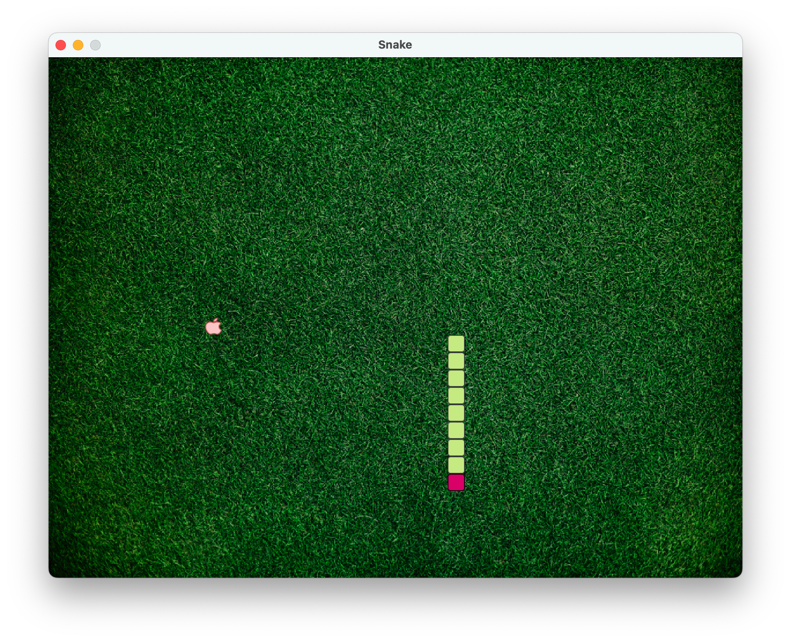

# Snake

Słynna gra zręcznościowa, która polega na zjadaniu owoców przez węża. Z każdym zjedzonym
zielonym jabłkiem zwiększa się jego długość. W przypadku przekroczenia 
obszaru gry następuje koniec rozgrywki.

## Intro z gry

## Kod źródłowy

Kod bazowy został pobrany ze strony <https://zetcode.com/javagames/snake/>, który 
został poddany refaktoryzacji.

## Etapy refaktoryzacji

+ Wdrożenie niedziałającego projektu,
+ Poprawa konfiguracji zasobów statycznych,
+ Wydzielenie klasy **Snake**,
+ Wydzielenie obslugi klawiatury do odzielnej klasy,
+ Wydzielenie odpowiedzialności do klasy **Snake**,
+ Poprawa mechaniki gry,
+ Mofyfikacja elementów graficznych,
+ Wydzielenie timera do kontrolera,
+ Aktualizacja dokumentacji.

## Autor

Tomasz Gądek
